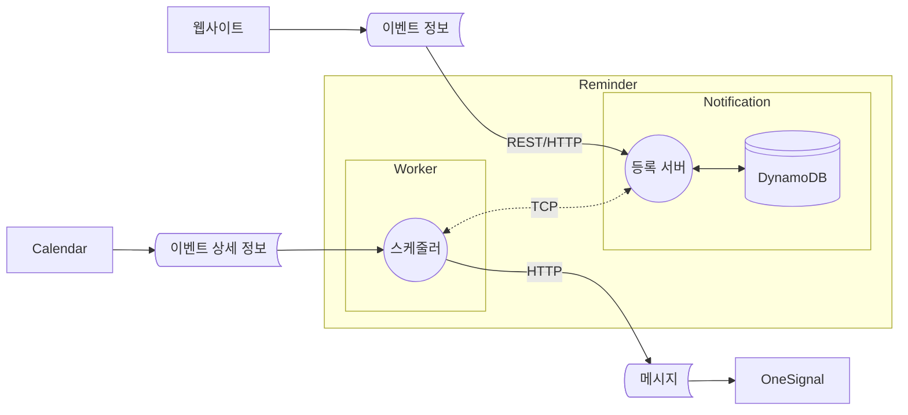

# 알림 서비스

> API를 통해 알림 시간을 관리하고, 스케쥴러가 매시간 알림을 발송하는 서비스

## 🚩 목차

- [🛠️ 기술 스택](#️-기술-스택)
- [💡 주요 기능](#-주요-기능)
- [📄 API 명세서](#-API-명세서)
- [📋 테스트 리포트](#-테스트-리포트)
- [🔀 데이터 흐름 다이어그램](#-데이터-흐름-다이어그램)
- [📦 배치 다이어그램](#-배치-다이어그램)
- [🚀 실행 방법](#-실행-방법)
- [📂 폴더 구조](#-폴더-구조)

## 🛠️ 기술 스택

[](https://nestjs.com/)
[![OneSignal](https://img.shields.io/badge/OneSignal-E54B4D.svg?logo=data:image/svg+xml;base64,PHN2ZyB3aWR0aD0iMzAwIiBoZWlnaHQ9IjMwMCIgZmlsbD0ibm9uZSIgeG1sbnM9Imh0dHA6Ly93d3cudzMub3JnLzIwMDAvc3ZnIj48cGF0aCBkPSJNMTQ5LjcwMiAwQzY2Ljk0NC4xNjEtLjQ2OCA2OC4xMS4wMDIgMTUwLjg2N2MuNDE0IDc3LjI5MiA1OS4zNTYgMTQwLjc0NiAxMzQuNzU4IDE0OC4zNTVhMS43MjcgMS43MjcgMCAwIDAgMS44OTYtMS43MjRWMTQ5Ljk5OWgtMTEuNjJhMS43MjUgMS43MjUgMCAwIDEtMS43MjQtMS43MjR2LTIzLjI1M2ExLjcyIDEuNzIgMCAwIDEgMS43MjQtMS43MjRoMzYuNTg2YTEuNzI1IDEuNzI1IDAgMCAxIDEuNzI0IDEuNzI0djE3Mi40NzZhMS43MTggMS43MTggMCAwIDAgLjU2MiAxLjI4MiAxLjczOCAxLjczOCAwIDAgMCAxLjMyOS40NDJDMjQwLjkyIDI5MS41ODQgMzAwIDIyNy42OTQgMzAwIDE0OS45OTkgMzAwIDY3LjA1NyAyMzIuNjc5LS4xNjEgMTQ5LjcwMiAwem00Mi42NjcgMjY1LjgwM2ExLjcyNCAxLjcyNCAwIDAgMS0yLjI5OS0xLjYyN3YtMjQuNjJhMi41OSAyLjU5IDAgMCAxIDEuNDgzLTIuMzM0IDk2LjcyNyA5Ni43MjcgMCAwIDAgNTUuMDU3LTg3LjIyM2MwLTUzLjc3NS00NC4xNjEtOTcuNDI0LTk4LjExNS05Ni41OTctNTEuMzIxLjc4Mi05My40MTggNDIuMTU1LTk1LjA1NiA5My40NTNhOTYuNzA5IDk2LjcwOSAwIDAgMCA1NS4wMjIgOTAuMzY3IDIuNTkgMi41OSAwIDAgMSAxLjQ4OSAyLjMzNHYyNC42MjZhMS43MjMgMS43MjMgMCAwIDEtMi4yOTkgMS42MjZDNjAuMTI4IDI0OC4zNzcgMjYuMjE1IDIwMi40NyAyNi43MDMgMTQ4Ljg1IDI3LjMwNyA4MS44NjcgODIuMDI1IDI3LjIxOCAxNDkuMDMgMjYuNzAxIDIxNy40NiAyNi4xNzIgMjczLjI5OSA4MS42OSAyNzMuMjk5IDE1MGMwIDUzLjEyLTMzLjc2NCA5OC40OTktODAuOTMgMTE1LjgwNHoiIGZpbGw9IiNGRkYiLz48L3N2Zz4=&style=flat&logoColor)](https://onesignal.com/)
[](https://aws.amazon.com/ko/dynamodb/)  
[](https://www.docker.com/)
[](https://www.typescriptlang.org/)  
[](https://swagger.io/)
[](https://jestjs.io/)
[](https://eslint.org/)

## 💡 주요 기능

- **NestJS 프레임워크**

    - NestJS 애플리케이션 아키텍처를 활용하여 모듈과 공급자 간의 의존성 주입을 설정
    - NestJS의 전송 계층 마이크로서비스 기능을 사용하여 마이크로서비스 간 TCP 통신을 구현

- **MSA (마이크로서비스아키텍처)**

    1. **Notification 서비스**
        - 알림 리소스를 관리하는 _REST API_ 제공
        - 알림 데이터는 _Key-Value_ 데이터베이스인 **DynamoDB**에 저장
        - _DynamoDB의 TTL(Time to Live)_ 설정을 활용하여, 예약된 알림이 지나면 자동으로 삭제됨
    2. **Worker 서비스**
        - *Cron 스케줄러*를 사용하여 매시간 주기적인 작업 수행
        - Notification 서비스와 *TCP 통신*을 통해 알림 데이터를 조회
        - **OneSignal** 서비스를 통해 알림 메시지를 전송

## 📄 API 명세서

<a href="https://daily1hour.github.io/PickMe-Reminder-Service">
열기</img>
</a>

| Method | URI         | Summary   | Request Header                     | Query String                                              | Request Body                                             | Code                                                |
| ------ | ----------- | --------- | ---------------------------------- | --------------------------------------------------------- | -------------------------------------------------------- | --------------------------------------------------- |
| POST   | /           | 등록      | Authorization:<br> Bearer \<token> |                                                           | event_id: string <br> send_at: date <br> status: enum    | 201: 성공 <br> 400: 입력값 오류 <br> 401: 권한 없음 |
| GET    | /           | 옵션 조회 | Authorization:<br> Bearer \<token> | start_date?: date <br> end_date?: date <br> status?: enum |                                                          | 200: 성공 <br> 400: 입력값 오류 <br> 401: 권한 없음 |
| GET    | /{event_id} | 조회      | Authorization:<br> Bearer \<token> |                                                           |                                                          | 200: 성공 <br> 400: 입력값 오류 <br> 401: 권한 없음 |
| PUT    | /{event_id} | 수정      | Authorization:<br> Bearer \<token> |                                                           | event_id: string <br> send_at: date <br> status: enum    | 200: 성공 <br> 400: 입력값 오류 <br> 401: 권한 없음 |
| PATCH  | /{event_id} | 부분 수정 | Authorization:<br> Bearer \<token> |                                                           | event_id?: string <br> send_at?: date <br> status?: enum | 200: 성공 <br> 400: 입력값 오류 <br> 401: 권한 없음 |
| DELETE | /{event_id} | 삭제      | Authorization:<br> Bearer \<token> |                                                           |                                                          | 200: 성공 <br> 400: 입력값 오류 <br> 401: 권한 없음 |

## 📋 테스트 리포트

<a href="https://daily1hour.github.io/PickMe-Reminder-Service/test-report">
열기</img>
</a>

| Test Suites | Tests     | Snapshots | Time     |
| ----------- | --------- | --------- | -------- |
| 7 passed    | 26 passed | 0 total   | 31.842 s |
| 7 total     | 26 total  |

## 🔀 데이터 흐름 다이어그램



## 📦 배치 다이어그램


## 🚀 실행 방법

### 도커환경

```sh
# build
$ docker-compose up --build

# run
$ docker-compose -d
```

### 로컬환경

```sh
$ npm install

# build
$ npm run build

# development
$ npm run start:dev

# production
$ npm run start:prod
```

## 📂 폴더 구조

> Monorepo + Microservice  
> Clean Architecture

```python
PickMe-Reminder-Service
├─ .eslintrc.js # eslint 린터 설정
├─ .github
│  ├─ workflows # 깃헙액션 워크플로어
│  │  └─ document-hosting.yml # 스웨거 및 테스터 리포트 작성
│  └─ document-index.html # 깃헙 페이지 진입점
├─ .gitignore
├─ .prettierrc # 포맷터
├─ notification # 알림 마이크로서비스
│  ├─ src
│  │  ├─ application # 유즈케이스 계층
│  │  │  ├─ dto.ts
│  │  │  ├─ service.spec.ts
│  │  │  └─ service.ts # 유즈케이스
│  │  ├─ domain # 도메인 계층
│  │  │  ├─ entity.ts # 엔티티 객체
│  │  │  └─ repository.ts # 레포지토리 인터페이스
│  │  ├─ infrastructure # 인프라스트럭쳐 계층
│  │  │  ├─ auth
│  │  │  │  ├─ jwtInterceptor.ts # JWT 토큰 인터셉터
│  │  │  │  └─ verifier.ts # Cognito로 토큰 인증
│  │  │  └─ dynamo # DynamoDB
│  │  │     ├─ model.ts # 스키마
│  │  │     ├─ provider.ts # 프로바이더 의존성
│  │  │     └─ repository.ts # 레포지토리 구현체
│  │  ├─ main.ts # 서버 실행 진입점
│  │  ├─ module.ts # 의존성 주입 모듈
│  │  ├─ presentation # 프레임워크 계층
│  │  │  ├─ controllers
│  │  │  │  ├─ httpController.ts # Http API
│  │  │  │  ├─ httpController.spec.ts
│  │  │  │  ├─ messageController.ts # Tcp API
│  │  │  │  └─ messageController.test.ts
│  │  │  └─ dtos # 데이터 전송 객체
│  │  │     ├─ index.ts
│  │  │     ├─ CreateRequestDTO.ts
│  │  │     ├─ ParametersDTO.ts
│  │  │     ├─ ReadRequestDTO.ts
│  │  │     └─ UpdateRequestDTO.ts
│  │  └─ utility
│  │     ├─ decorators # 커스텀 데코레이터
│  │     │  ├─ index.ts
│  │     │  ├─ AtLeastOneOption.ts # 옵션 하나 이상 유효성 검사
│  │     │  ├─ IsTimeRange.ts # 시간 범위 유효성 검사
│  │     │  ├─ PayloadEX.ts # Payload를 dto 변환하고 데코레이터 기반 유효성 검사
│  │     │  └─ TrimSeconds.ts # 시간 데이터의 분초 삭제 변환
│  │     ├─ downloadOpenAPI.ts # yaml 파일로 스웨거 문서 다운로드
│  │     └─ generatorSwagger.ts # 스웨거 문서 생성
│  ├─ .env
│  ├─ global.d.ts # 환경변수 타입
│  ├─ jest.config.js
│  ├─ package.json # 워크스페이스 의존성 관리
│  ├─ tsconfig.build.json
│  └─ tsconfig.json # typescript 설정
├─ worker # 알림 워커 서비스
│  ├─ src
│  │  ├─ application
│  │  │  ├─ dto.ts # 페이로드 DTO
│  │  │  ├─ ports # 인터페이스
│  │  │  │  ├─ index.ts
│  │  │  │  ├─ client.ts # 알림 저장 서비스
│  │  │  │  ├─ receiver.ts # 메시지 수신
│  │  │  │  └─ sender.ts # 메시지 발송
│  │  │  └─ usecases
│  │  │     ├─ cron.ts # 잡 스케줄러
│  │  │     ├─ cron.test.ts
│  │  │     ├─ service.ts # 알림 TCP 요청, 발송 처리, 완료 처리
│  │  │     └─ service.test.ts
│  │  ├─ infrastructure
│  │  │  ├─ api # axios API 인터셉터
│  │  │  │  ├─ index.ts
│  │  │  │  ├─ calendarClient.ts
│  │  │  │  └─ onesignalClient.ts
│  │  │  ├─ clientImpl.ts # 마이크로서비스 호출 구현체
│  │  │  ├─ receivers
│  │  │  │  ├─ calendarReceiver.ts # 캘린더 서비스 구현체
│  │  │  │  └─ calendarReceiver.test.ts
│  │  │  └─ senders
│  │  │     ├─ webSender.ts # 웹 메시지 발송 구현체
│  │  │     └─ webSender.test.ts
│  │  ├─ main.ts # 서버 실행 진입점
│  │  └─ module.ts # 의존성 주입 모듈
│  ├─ .env
│  ├─ global.d.ts
│  ├─ jest.config.js
│  ├─ package.json
│  ├─ tsconfig.build.json
│  └─ tsconfig.json
├─ nest-cli.json # nestjs 모듈 구조 설정
├─ docker-compose.yml # 도커컴포즈
│  ├─ Dockerfile.notification # 알림 마이크로서비스 도커파일
│  └─ Dockerfile.worker # 워커 마이크로서비스 도커파일
├─ package.json # 의존성 관리
│  └─ package-lock.json
├─ jest.config.js # jest 테스트 설정
└─ test # 통합 테스트
   ├─ app.e2e-spec.ts
   └─ jest-e2e.json
```
